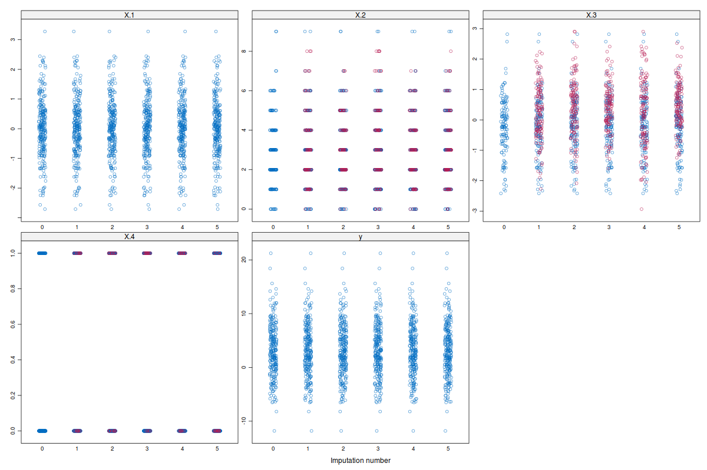

---
output:
  md_document:
    variant: markdown_github
---

```{r, echo = FALSE}
knitr::opts_chunk$set(
  collapse = TRUE,
  comment = "#>",
  fig.path = "README-"
)
```

# ImputeRobust: Multiple Imputation with GAMLSS

The `ImputeRobust` package adds
to [https://cran.r-project.org/web/packages/mice/index.html](MICE) an
imputation method based on generalized additive models for location,
scale, and shape introduced by de Jong (2012), de Jong, van Buuren and
Spiess (2016). It has been tested mostly with continous variables,
count, and binary data.

## Installation

The latest version can be installed from GitHub as follows:

```{r eval = FALSE}
install.packages("devtools")
devtools::install_git(url = "https://github.com/dsalfran/ImputeRobust", 
                      branch = "master")
```

## Main functions

The main functions in the `ImputeRobust` package are:

|Function Name            | Description                                                           |
|-------------------------|---------------------------------------------------------------------- |
|`mice.impute.gamlss()`   | Impute data using GAMLSS                                              |
|`mice.impute.gamlssBI()` | Same as `mice.impute.gamlss()` but specially tailored for binary data |

## Examples

The package is intended to be use with mice, adding new methods based
on GAMLSS. For example, let's say we have a data sets with missing values:

```{r, echo = FALSE}
load('data/sample.rda')
suppressMessages(library(ImputeRobust))
```

```{r}
# First lines of the data set
head(sample.data)
```

```{r}
# Missing pattern
md.pattern(sample.data)
```

```{r, eval = FALSE}
# Create the imputed data sets
imputed.sets <- mice(sample.data,
                     method = c("gamlss", "gamlss",
                                "gamlss", "gamlssBI", "gamlss"),
                     visitSequence = "monotone",
                     maxit = 1, seed = 97123)
```



## References

de Jong, R., van Buuren, S. & Spiess, M. (2016) Multiple Imputation of
Predictor Variables Using Generalized Additive Models. Communications
in Statistics -- Simulation and Computation, 45(3), 968--985.

de Jong, Roel. (2012). “Robust Multiple Imputation.” Universität
Hamburg. \url{http://ediss.sub.uni-hamburg.de/volltexte/2012/5971/}.

Rigby, R. A., and Stasinopoulos, D. M. (2005). Generalized Additive
Models for Location, Scale and Shape. Journal of the Royal Statistical
Society: Series C (Applied Statistics) 54 (3): 507–54.

