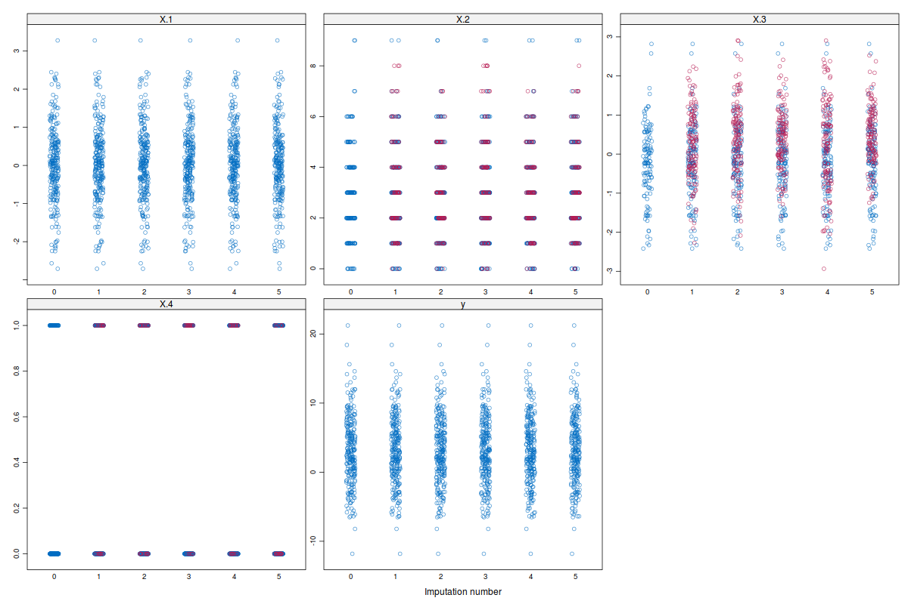

ImputeRobust: Multiple Imputation with GAMLSS
=============================================

The `ImputeRobust` package adds to [https://cran.r-project.org/web/packages/mice/index.html](MICE) an imputation method based on generalized additive models for location, scale, and shape introduced by de Jong (2012), de Jong, van Buuren and Spiess (2016). It has been tested mostly with continous variables, count, and binary data.

Installation
------------

The latest version can be installed from GitHub as follows:

``` r
install.packages("devtools")
devtools::install_git(url = "https://github.com/dsalfran/ImputeRobust", 
                      branch = "master")
```

Main functions
--------------

The main function in the `ImputeRobust` package is `mice.impute.gamlss()` which model the response distribution with a Normal distribution. All other functions are variants of the main function with a different fixed response distribution.

| Function Name              | Response distribution  |
|----------------------------|------------------------|
| `mice.impute.gamlss()`     | Normal                 |
| `mice.impute.gamlssBI()`   | Binomial               |
| `mice.impute.gamlssJSU()`  | Johnson's SU           |
| `mice.impute.gamlssPO()`   | Poisson                |
| `mice.impute.gamlssTF()`   | t-distribution         |
| `mice.impute.gamlssZIBI()` | Zero inflated binomial |
| `mice.impute.gamlssZIP()`  | Zero inflated Poisson  |

Examples
--------

The package is intended to be used with mice, adding new methods based on GAMLSS. For example, let's say we have a data sets with missing values:

``` r
# First lines of the data set
head(sample.data)
#>           X.1 X.2       X.3 X.4         y
#> 1 -0.89662664  NA        NA  NA  6.943309
#> 2 -1.75990198  NA        NA   1  5.272678
#> 3  0.60351069   4 -2.330010   0  3.669100
#> 4 -0.05911172   2 -1.010365   0 -2.995331
#> 5  0.95021728   4        NA   1  5.736138
#> 6  1.61066030  NA        NA   1 18.415576
```

``` r
# Missing pattern
md.pattern(sample.data)
#>     X.1 y X.4 X.2 X.3    
#> 125   1 1   1   1   1   0
#>  39   1 1   1   1   0   1
#>  64   1 1   1   0   0   2
#>  22   1 1   0   0   0   3
#>       0 0  22  86 125 233
```

``` r
# Create the imputed data sets
imputed.sets <- mice(sample.data,
                     method = c("gamlss", "gamlssPO",
                                "gamlssJSU", "gamlssBI", "gamlss"),
                     visitSequence = "monotone",
                     maxit = 1, seed = 97123)
```

In the following plot the red circles represent the imputed values and the blue circles the observed data. 

References
----------

de Jong, R., van Buuren, S. & Spiess, M. (2016) Multiple Imputation of Predictor Variables Using Generalized Additive Models. Communications in Statistics -- Simulation and Computation, 45(3), 968--985.

de Jong, Roel. (2012). “Robust Multiple Imputation.” Universität Hamburg. .

Rigby, R. A., and Stasinopoulos, D. M. (2005). Generalized Additive Models for Location, Scale and Shape. Journal of the Royal Statistical Society: Series C (Applied Statistics) 54 (3): 507–54.
